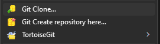
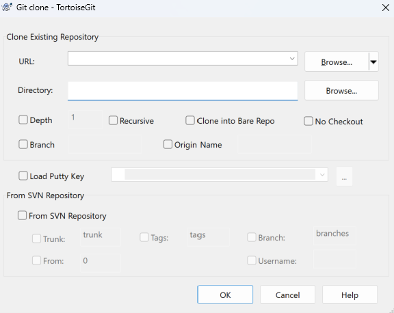
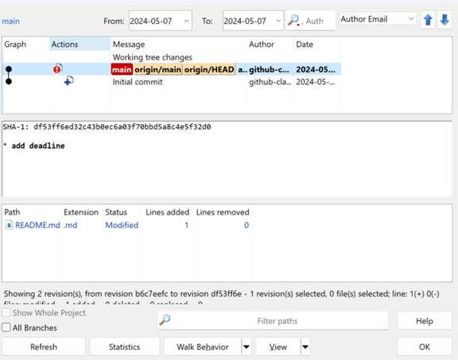
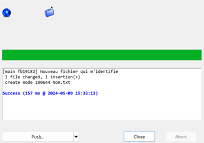
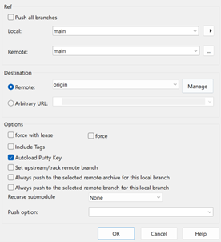

# 🔬 Laboratoire 1
## 🎯 Objectifs
- Se familiariser avec Github
- Se familiariser avec le protocole I2C
- Se familiariser avec l'horloge temps réel DS1307

## 💻 Répertoire Git personnel
1. Récupérer le lien d’invitation au Laboratoire 1 fournit par l’enseignant.e et accepter l’invitation. Il vous faut un compte Github pour accepter l’invitation. À ce moment, votre répertoire (*repository*) se créera automatiquement. Conserver l’URL de votre répertoire personnel.
2. Effectuer un clic-droit dans le répertoire où vous voudrez travailler et sélectionner l’option Tortoise Git --> Git Clone :

3. Dans la fenêtre pop-up qui s’ouvre, entrer l’URL de votre repo. Le champ *Directory* devrait être déjà rempli avec le chemin d’accès de votre dossier de travail.

4. Vérifier l’historique de modifications en cliquant droit et en sélectionnant l’option Tortoise Git --> Show Log. Un historique de version devrait s’afficher :

Les seuls *commits* visibles sont ceux générés automatiquement par Github au moment de l’acceptation du laboratoire.

5. Créer un fichier texte Nom.txt contenant votre nom complet dans le répertoire de travail.
6. Cliquer sur l’option Tortoise Git --> Commit
7. Entrer une description du changement à publier et cliquer sur la boîte (*checkbox*) à côté du nouveau fichier :

8. Lorsqu’on appuie sur l'option *Commit*, on s’engage à publier un changement prêt pour la publication. Toutes les modifications sont encore locales à ce stade. Lorsque les changements sont prêts à publier, on les publie au serveur avec la commande *Push*.

9. Lorsqu’on publie nos modifications sur le serveur, il est possible de travailler sur sa propre branche et demander à l’administrateur du répertoire de migrer nos changements dans la branche principale. Dans notre cas, il n’y a pas beaucoup de gains à utiliser cette gestion, nous n’utiliserons qu’une branche, la branche principale (*main*). Nous allons donc publier la branche locale *main* dans la branche distante *main* :

Si tout a fonctionné, un écran nous le confirme :

Vous remarquerez l’option *Create pull request*. Nous ne l’utiliserons pas dans ce cours, mais sachez que si vous travaillez dans un projet, il est possible de notifier à l’administrateur du répertoire de faire une révision de votre travail pour migrer vos changements dans la branche principale.

10. Une fois l’opération *Push* terminée, cliquer sur *Close*.
11. Il serait judicieux à cette étape de valider avec l’enseignant.e qu’il.elle a accès à vos modifications avant de continuer.

## ⌚ Lire l'heure sur l'horloge temps réel

1. Pour programmer le microcontrôleur Arduino avec les fichiers programmes sans le code source, nous utiliserons le logiciel AVRDUDESS, qui est une interface graphique pour le programme AVRDUDE. Pour l’utiliser, double-cliquer sur le programme avrdudess. Les options pertinentes et la configuration que nous utiliserons sont détaillés ici :

|Paramètre|	Valeur|
|Programmer|USBtiny simple USB programmer|
|Port|Usb|
|MCU|ATmega328P|
|Flash|Le chemin d’accès du fichier HEX qu’on veut programmer (on peut le choisir en cliquant sur …)|
|Bouton Program!|Une fois tout configuré, on programme le microcontrôleur avec ce bouton|

2. Pour se pratiquer, programmer le microcontrôleur avec le fichier de programme flash_ramp.hex fourni dans le répertoire de travail. On devrait voir la LED L (celle soudée sur le circuit Arduino UNO) clignoter de plus en plus rapidement.
3. Lorsque la programmation est maîtrisée, programmer le microcontrôleur avec le fichier de programme CLI_I2C.hex fourni dans le répertoire de travail.
4. Le programme CLI_I2C est une interface en ligne de commande sérielle qui permet de demander au microcontrôleur de lancer des commandes I2C que nous lui avons programmées. Il nous permettra de communiquer avec les différents périphériques connectés au bus I2C. Le Tableau suivant détaille les commandes pertinentes pour ce laboratoire. Noter que tous les paramètres sont entrés en format décimal.

|Commande|Description|
|help|Liste les commandes disponibles. On peut aussi entrer help suivi du nom d’une commande pour une description détaillée de la commande|
|scan|Permet de lister les périphériques connectés au bus|
|scan1 xxx|Permet de vérifier si un périphérique est présent à l’adresse de périphérique xxx|
|read xxx yyy|Lit la donnée à l’adresse yyy du périphérique xxx|
|write xxx yyy zzz|Écrit la donnée zzz à l’adresse yyy du périphérique xxx|

5. Valider que la date et l’heure sont programmés dans l’horloge temps réel (RTC) en lisant l’adresse 0. Si la valeur lue est 0x80, le RTC n’est pas programmé. Demander à l’enseignant.e de le faire.
6. En se référant à la fiche technique du DS1307, lire la date et l’heure sur l’horloge temps réel et créer un fichier texte dans le répertoire de travail documentant toutes les commandes entrées et résultats obtenus.
7. Publier le répertoire de travail et valider que l’enseignant.e peut y accéder.

