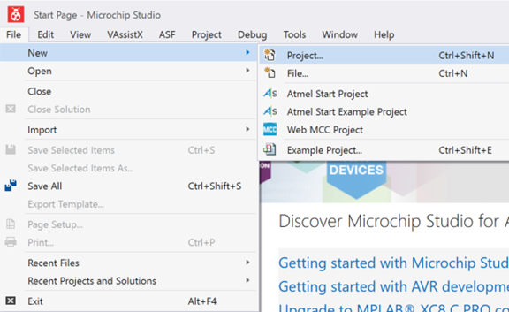
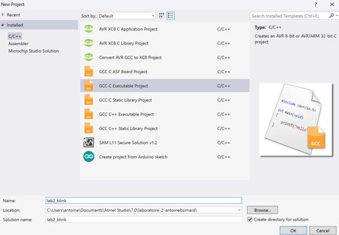
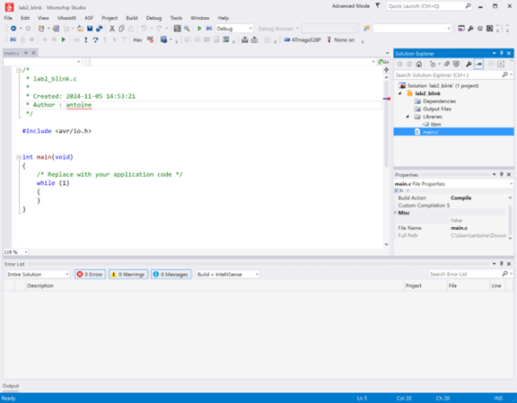

# 🔬 Laboratoire 2 - Blink (pas 182)
## 🎯 Objectifs
- S’approprier l’environnement de développement Microchip Studio
- S’initier à la programmation C
- Se familiariser avec les GPIOs et Timers


## 🐞 Microchip Studio

1. Accepter le laboratoire 2 sur GitHub Classroom et cloner le repo dans le dossier C:\Users\VOTRE_NOM\Documents\Atmel Studio\7.0
2. Créer un **Nouveau Projet**, en sélectionnant New / Project



3. Dans la fenêtre pop-up qui s’ouvre, sélectionner un projet **C/C++** et le type **GCC C Executable Projet**. Donner un nom pour le projet et sélectionner le répertoire de travail GIT comme *location*.



4. Dans la fenêtre *Device Selection*, on choisira **ATmega328P**, il suffira d’entrer «328» dans le champ de recherche.

5. La capture d'écran plus bas illustre notre environnement de développement (**IDE** en anglais pour *Integrated Development Environment*). À droite, on retrouve l’arborescence de fichiers de notre projet, incluant notre programme principal (main.c). Le fichier main.c est ouvert par défaut. C’est ici que nous programmerons principalement. La fenêtre en bas nous indiquera lorsqu’il y aura une erreur de compilation ou de programmation du microcontrôleur.



## 💻 Programmation C

Avant de modifier notre programme principal, je vous invite à vous familiariser avec les bases du langages de programmation C. Rendez-vous à l'adresse https://www.onlinegdb.com/online_c_compiler pour expérimenter certaines manipulation. Voici quelques exemples de programmes :

```c
//Ceci est un commentaire, il permet d'expliquer notre code en lagage clair
// On peut créer un commentaire sur une ligne en précédant le texte par : //
/* Cette combinaison (barre oblique + *) permet de commencer un commentaire
sur plusieurs lignes.
Le commentaire sur plusieurs lignes se termine avec : */
#include <stdio.h>  //Cette ligne permet d'importer une librarie (ici stdio.h qui nous permet d'interagir avec l'écran)

int main()  //Cette ligne permet de définir le début du programme principal (main)
{       // Toutes les lignes de code de la fonction "main" sont compris dans des accolades : { et }
    printf("Hello World");  //La commande printf permet d'afficher une chaîne de caractère, ici "Hello World"
                            //Vous remarquerez que les lignes se terminent par le caractère ;
    return 0;               //Dans ce cas-ci, la fonction main doit retourner une valeur, on a retourné 0 (pas important pour l'instant)
}
```

Je vous inviterais à expérimenter un peu avec le compilateur. Par exemple, le programme suivant crée une variable a et lui assigne la valeur 0. On retourne ensuite à l'écran la valeur de a :

```c
#include <stdio.h>

int main()
{
    int a = 0;
    //Changez cette ligne
    printf("La valeur de a est : ");
    printf("%d",a);
    

    return 0;
}
```

Maintenant, trouvez une façon de changer la valeur de a pour votre âge en ne changeant que la ligne idenfiée ```//Changez cette ligne```.

## 💡 Allumer la LED L
1. De retour à Microchip Studio, modifier le programme afin d’allumer la LED L montée sur la carte imprimée Arduino UNO. Pour ce faire, il suffira de récupérer le programme de départ et modifier la fonction ```setupGPIO()``` pour qu’elle configure PB5 en sortie et qu’elle sorte la valeur «1» sur la sortie PB5.

2. La LED embarquée sur le Arduino Uno est au bit 5 du **PORTB**. Pour configurer le GPIO correspodant en sortie, il faudra définir la valeur de **DDRB** pour que le 5<sup>e</sup> bit soit à 1 (1=sortie). À vous de trouver la valeur que doit prendre **DDRB** et de modifier la fonction ```setupGPIO()```. Une fois ceci terminé, la LED sera configurée en sortie.

3. Mais la LED n'allumera pas encore, il faudra aussi sortir la valeur 1, c'est-à-dire +5V sur le bit correspodant. Nous pouvons le faire en changeant la valeur du register **PORTB**. Il faut trouver la valeur pour que le bit 5 soit aussi à 1.

4. Lorsque le code sera prêt à être testé, cliquer sur *Build / Build Solution* ou taper F7 ou cliquer sur l'icône *Build Solution*.

5. Débugger les erreurs s’il y en a.

6. Programmer le microcontrôleur. Il y a 2 façons de programmer le microcontrôleur : avec le tinyUSB ou avec l’interface USB du Arduino UNO.

:::tip **Option 1 : Programmation avec tinyUSB**
1. Connecter le tinyUSB programmer sur le connecteur ISCP du Arduino UNO
2. Cliquer sur Programmer ATmega328 avec USBTiny
3. Si l’option n’est pas présente, sélectionner Tools / External Tools et entrer les options indiquées dans le fichier texte Commandes External Tools Atmel Studio fourni au laboratoire 1.
4. Si l’option External Tools n’est pas disponible, changer le Mode en haut du IDE Microchip Studio pour ***Advanced Mode***.
:::

:::tip **Option 2 : Programmation avec le port COM**
1. Ouvrir le programme Tera Term
2. Dans la fenêtre pop-up qui s’ouvre, noter le numéro dans l’option serial (COMx). Si la fenêtre pop-up ne s’ouvre pas, on peut l’ouvrir avec File / New connection
3. Dans Microchip Studio, sélectionner Tools / External Tools et entrer les options indiquées dans le fichier texte Commandes External Tools Atmel Studio fourni au laboratoire 1 en remplaçant «x» dans COMx pour le numéro de port noté à l’étape précédente.
4. Si l’option External Tools n’est pas disponible, changer le Mode en haut pour Advanced Mode (voir note à l'option 1).
5. Cliquer sur Tool / Programmer Arduino Uno COMx où x est votre numéro. Si la fenêtre Output Window retourne une erreur : stk500_recv(): programmer is not responding, demander à l’enseignant.e de reprogrammer le bootloader Arduino (vous pouvez aussi utiliser AVRDUDESS et flasher le programme flash_ramp…).
:::

7. Une fois la Partie 2 complétée, faire un commit et push des modifications.

## 🔆 Faire clignoter la LED 🔅

8. Implémenter la fonction ```setupTimer1()``` pour que l’interruption survienne à chaque seconde. Aidez-vous des tableaux et équation plus bas pour trouver les valeurs à donner à chacun des registres du timer1.

**TCCR1A**
|Bit|7|6|5|4|3|2|1|0|
|---|---|---|---|---|---|---|---|---|
|Fonc|COM1A1|COM1A0|COM1B1|COM1B0|-|-|WGM11|WGM10|
|Valeur| | | | | | | | |


**TCCR1B**
|Bit|7|6|5|4|3|2|1|0|
|---|---|---|---|---|---|---|---|---|
|Fonc|-|-|-|WGM13|WGM12|CS12|CS11|CS10|
|Valeur| | | | | | | | |

OCR1A = 16MHz/prédiv/f-1 = ?

9. Modifier la fonction d’interruption, aussi appelée **ISR** pour que la LED L allume pendant 1s, puis s’éteigne pendant 1s.
10. Une fois la partie 3 complétée, faire un commit et push des modifications.
11. Publier le répertoire de travail et demander la confirmation de l’enseignant.e.
